# AzureSQLEdge
Azure SQL Edge install/config information

**Rationale**
Microsoft SQL Server (Express, Developer etc.) is only available for Intel CPUs. It works on x64 Mac and PCs but it does not work on the new M1/M2 Macs shipped by Apple. The workaround to allow students to use SQL Server is to make them install Azure SQL Edge instead. 
Azure SQL Edge is an IoT, ARM compatible version of SQL Server. It offers most of what we need for TECH 60701, and arguable everything we need for our undergrad and certificate database courses. However, it does have limitations, the biggest one being that it does not support CRL data types (e.g., geography) and functions, or graph databases.

**It is the responsibility of the person teaching the course to verify that using Azure SQL Edge is ok for their course. This means testing queries, assignments, exams etc. prior to offering this as a workaround for students.**

Officially, HEC does not support these Macs because the Windows image we provide is made for Intel CPUs only (see Prerequis section on the [DTI website](https://hecmontreal.atlassian.net/wiki/spaces/DTIKB/pages/1944355282/Bac-Pack+HEC+-+Installation+et+configuration+Windows+sur+Mac+OS)). Note that there is currently no official statement from Microsoft about releasing an ARM compatible version of MSSQL.

## How-to ##

### Pre-requesites ###
1.  Verify that your Mac is indeed running with an ARM M1/M2 chip (check system preferences, or "About this Mac" on the main Apple menu in Mac OS).

### Install Docker Desktop ###
1.  Install [Docker desktop for your Mac](https://docs.docker.com/desktop/install/mac-install/). **Make sure you select an installer for a Mac with an Apple chip, NOT a Mac with Intel chip**.
2.  Start Docker desktop from your launcher.
3.  Pull the Azure SQL Edge image from the Docker repository:
    * Open a Terminal
    * In the terminal, type `sudo docker pull mcr.microsoft.com/azure-sql-edge:latest`
4. Once the image is installed, you should be able to see it in your Docker desktop interface, as shown below:
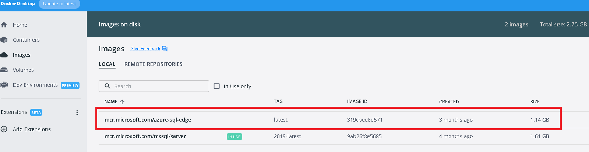

### Install Azure Data Studio ###
1. Install **Azure Data Studio**. Azure Data Studio is a substitute for SQL Server Management Studio, the client application we use to type in queries etc. SQL Server Management Studio is not available on Mac OS (on a Mac with an Intel CPU where you installed Windows via Parallel or the school's virtual box image, you can install it, but that is not the case here):
    * Go to the [Azure Data Studio Download page for Mac OS](https://docs.microsoft.com/en-us/sql/azure-data-studio/download-azure-data-studio?view=sql-server-ver16#macos-installation)
    * Follow installation instructions.
  
### Start your Azure SQL Edge container and connect to it via Azure Data Studio ###
1. Open a terminal
2. Execute the following command (you can copy and paste :
      * `sudo docker run -e ACCEPT_EULA=Y -e MSSQL_SA_PASSWORD=yourStrong(!)Password -p 1433:1433 --name azuresqledge -d mcr.microsoft.com/azure-sql-edge:latest`
      * As you can see, this means that the admin (sa) password for the server will be `yourStrong(!)Password`. You can change it if you want but this means that you will need to use the right password in Azure Data Studio to connect to it.
3. In the future, you can start and stop the container with the click of a button directly from Docker Desktop:
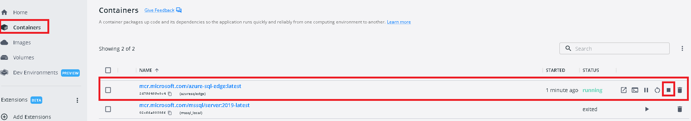

### Download the AdventureWorks2019 backup file ###
1. Download the [AdventureWorks2019 backup file](https://github.com/Microsoft/sql-server-samples/releases/download/adventureworks/AdventureWorks2019.bak).
2. Take good note of the location of the .bak file you just saved. By default, it goes in your user profile `Downloads` folder. The rest of the tutorial assumes that is the case, adapt if needed.

### Restore the AdventureWorks2019 backup ###
1. First thing we need to do is to copy the backup file from your Mac OS to the Docker container. That's because the Docker container is a different (virtual) machine running inside, but separately from, your Mac OS installation.
2. Open a terminal and execute the following commands (one command per bullet point): 
      * `cd Downloads`
      * `sudo docker cp AdventureWorks2019.bak azuresqledge:/var/opt/mssql/data`
3. Open Azure Data Studio to restore the database:
      * Create a connection to your Docker container:  
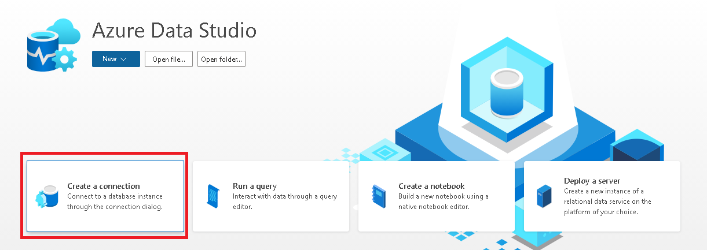

      * This will open a screen to create a new connection to your Docker container:
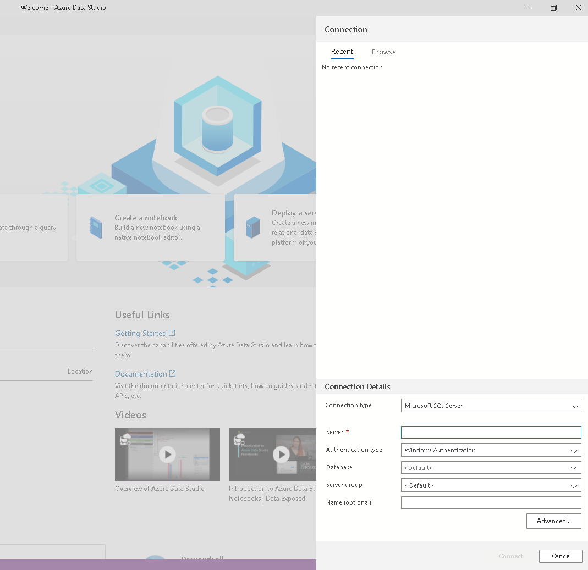

      * Enter connection info as shown (remember the password is `yourStrong(!)Password` (you can copy/paste this into the password text field) and click `Connect`:
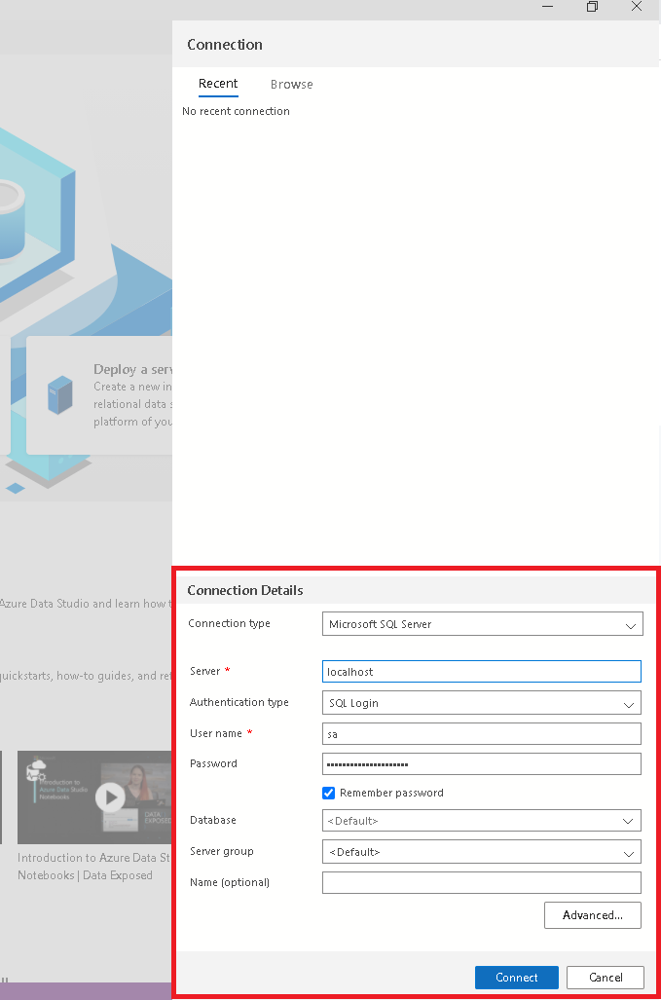  

      * In the bottom left side of the main screen, click on the settings icon, then on `Settings` in the menu:
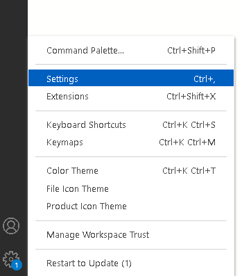  

      * In the settings screen, type `enable preview features` in the search field.
      * Check the Workbench: `Enable Preview Features item`:
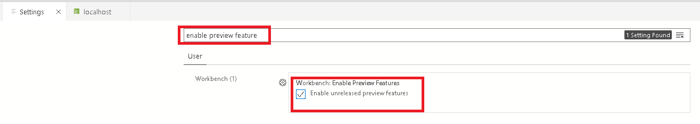

      * Go back in the `localhost` tab on the top of the screen (you may close the `Settings` tab if you want) and restore the database by right-clicking anywhere in the list of databases on your server:
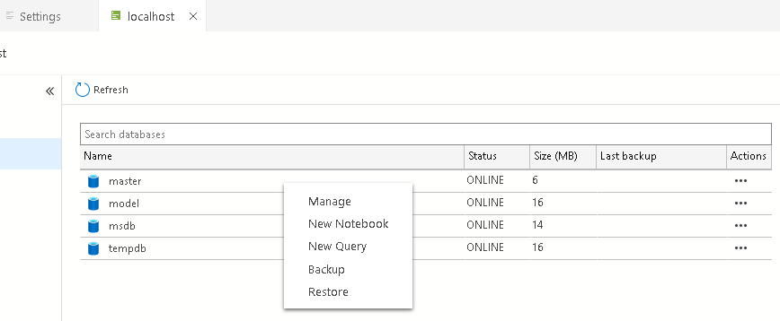

      * In the restore screen, select Restore from `Backup file` rather than `Database`
      * Then click on the `...` in the `Backup file path` field:
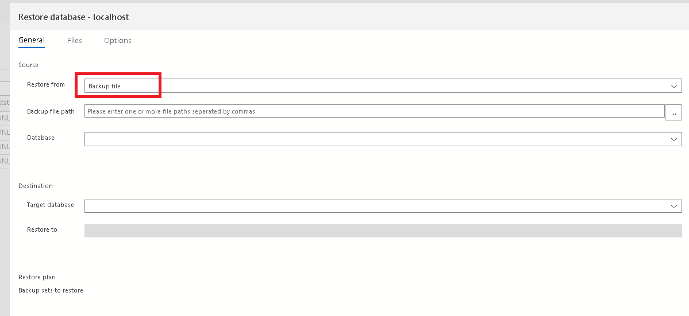

      * In the window, you have to find the AdventureWorks2019.bak file in your container (NOT in Mac OS, remember we copied that earlier!).
      * Locate the `var` folder, under it, locate `opt`, under that `mssql`, then under that, `data`, then file the `bak` file.
      * Then click `OK`:
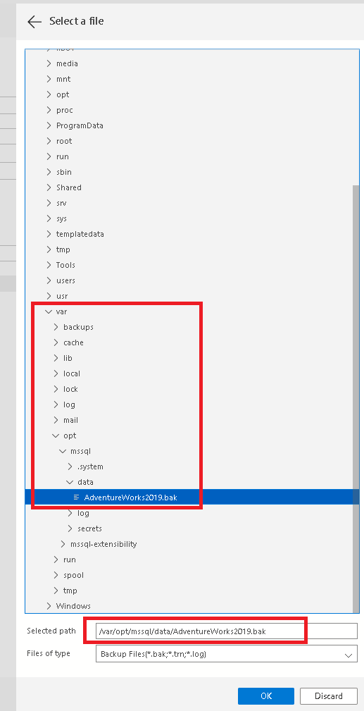

      * You will go back into the database restore screen, but it will have information filled in for you, including the database name.
      * Click on the `Restore` button: 
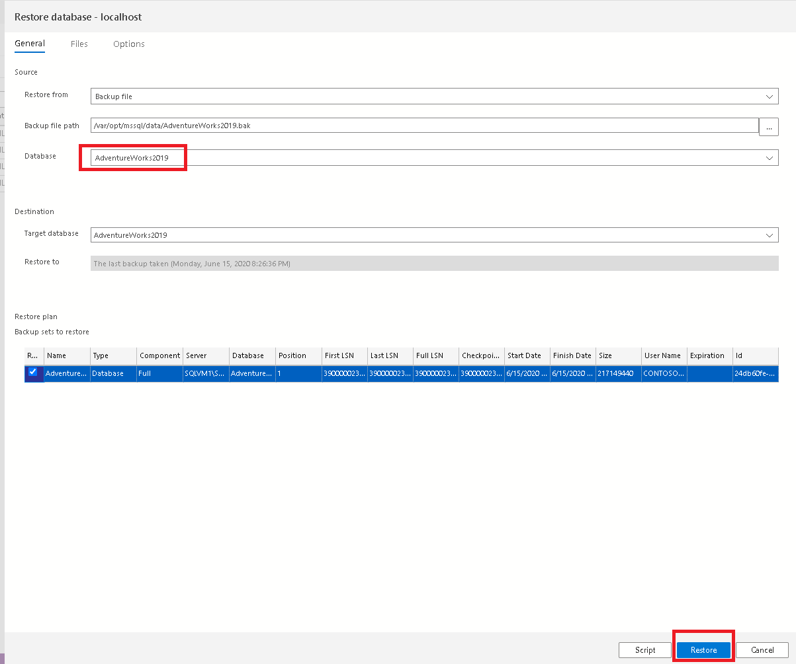

      * The restore should complete quickly, as shown at the bottom of the screen:
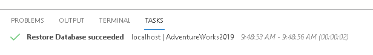

      * Once the restore is complete hit the `Refresh` button in the `localhost` tab:      
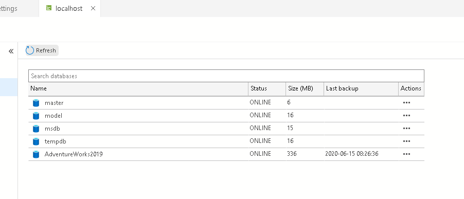

      * Double-click on the AdventureWorks2019 database to view its tables and if you want, open a new query by clicking `New Query`:    
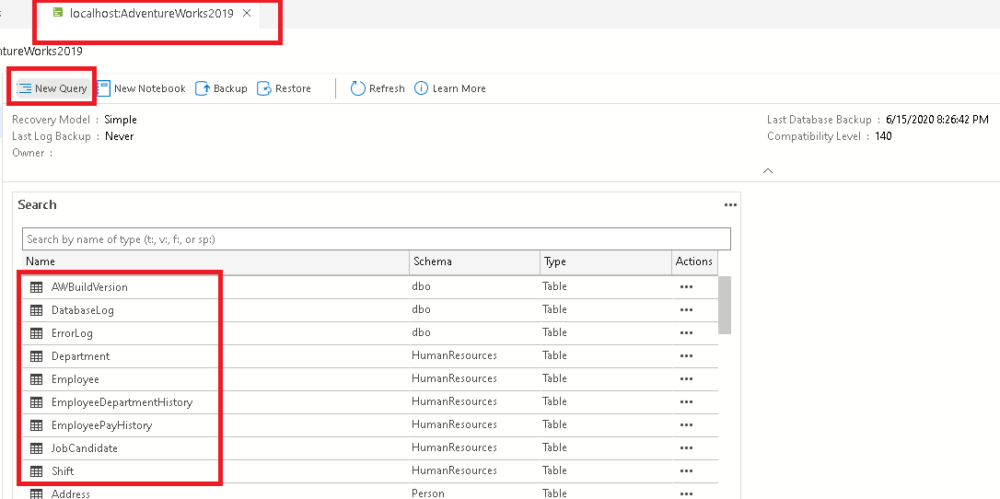

### Modify the database to remove CRL columns in tables ###
1. Right now, executing any query against a table that contains a CRL data type returns an error:
2. Execute the following commands to remove problematic columns:
    * **This means that you can only do this if you know that you will not need to use these columns!**
    * `USE AdventureWorks2019`
    * `GO`
    * `ALTER TABLE Person.Address DROP COLUMN SpatialLocation;`
    * `DROP INDEX HumanResources.Employee.IX_Employee_OrganizationLevel_OrganizationNode;`
    * `ALTER TABLE HumanResources.Employee DROP COLUMN OrganizationLevel;`
    * `DROP INDEX HumanResources.Employee.IX_Employee_OrganizationNode;`
    * `ALTER TABLE HumanResources.Employee DROP COLUMN OrganizationNode;`
    * `ALTER TABLE Production.ProductDocument DROP CONSTRAINT FK_ProductDocument_Document_DocumentNode;`
    * `ALTER TABLE Production.ProductDocument DROP CONSTRAINT PK_ProductDocument_ProductID_DocumentNode;`
    * `ALTER TABLE Production.ProductDocument DROP COLUMN DocumentNode;`

### Verify that everything works ###
1. Execute the following query: `SELECT * FROM AdventureWorks2019.HumanResources.Employee;`.
    * It should run without issues.
